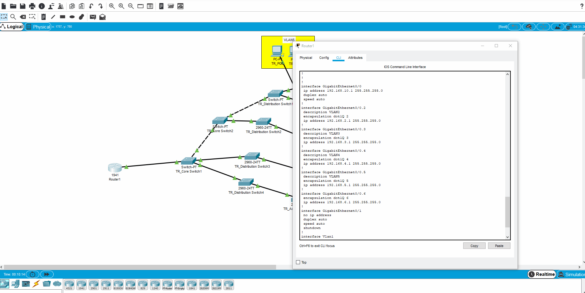

# PacketTracerVLANTesting
This file is from the Cisco Packet Tracer application and was created to show my ability to utilize router level commands and assign IP's via dhcp as well as ensuring proper communication to computers from different VLANS

Shown here is the VLAN configuration from the router as well as the dhcp pools for each VLAN

Shown here is a successful message from a computer in one VLAN to a computer in another VLAN

insert gif here
